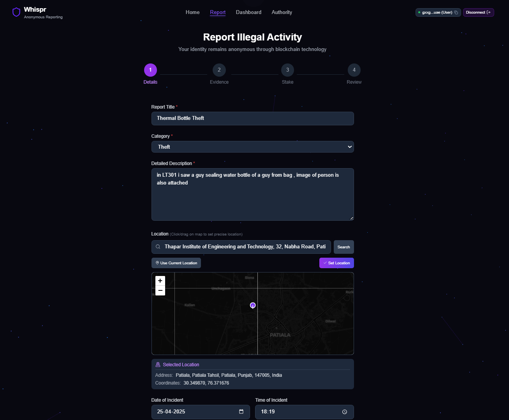
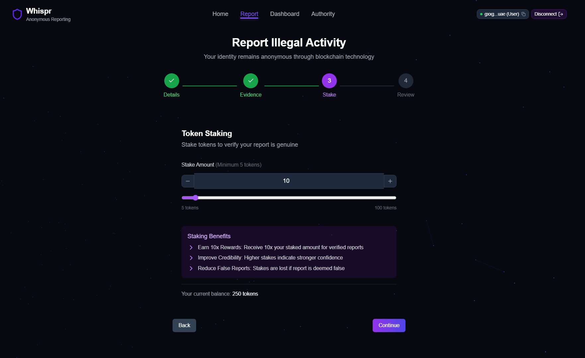

# Whispr

## Decentralized Anonymous Crime Reporting Platform

A blockchain-powered platform for anonymous crime reporting built on the Internet Computer Protocol (ICP). Whispr enables citizens to securely report crimes while maintaining complete anonymity through cryptographic identity protection.

**Live Application:** https://aoicy-vyaaa-aaaag-aua4a-cai.icp0.io/

---

## Table of Contents

1. [Overview](#overview)
2. [Architecture](#architecture)
3. [Features](#features)
4. [Technology Stack](#technology-stack)
5. [Project Structure](#project-structure)
6. [Getting Started](#getting-started)
7. [Testing](#testing)
8. [Deployment](#deployment)
9. [API Reference](#api-reference)
10. [Screenshots](#screenshots)

---

## Overview

Whispr addresses the critical challenge of anonymous crime reporting by leveraging blockchain technology. Traditional reporting systems often fail to protect informer identities, leading to reluctance in reporting criminal activities. Whispr solves this by:

- Generating cryptographic identities that cannot be traced back to users
- Storing all data on decentralized infrastructure
- Implementing a token staking mechanism to ensure report authenticity
- Providing rewards for verified reports

### Problem Statement

```
+-------------------------------------------------------------------------+
|                     Traditional Crime Reporting                          |
+-------------------------------------------------------------------------+
|  [Citizen] ---> [Report] ---> [Authority Database]                      |
|      |                              |                                    |
|      +-- Identity Exposed <---------+                                    |
|                 |                                                        |
|                 v                                                        |
|          Risk of Retaliation                                             |
+-------------------------------------------------------------------------+
```

### Whispr Solution

```
+-------------------------------------------------------------------------+
|                        Whispr Architecture                               |
+-------------------------------------------------------------------------+
|  [Citizen] ---> [Crypto Identity] ---> [ICP Blockchain] <--- [Authority]|
|      |              |                        |                    |      |
|      |              v                        v                    |      |
|      |        Anonymous ID           Immutable Record             |      |
|      |              |                        |                    |      |
|      +--------------+------------------------+--------------------+      |
|                            |                                             |
|                            v                                             |
|                   Identity Protected                                     |
+-------------------------------------------------------------------------+
```

---

## Architecture

### System Architecture

```
+----------------------------------------------------------------------------+
|                              WHISPR SYSTEM                                  |
+----------------------------------------------------------------------------+
|                                                                            |
|   +------------------+         +------------------+                        |
|   |   FRONTEND       |         |   BACKEND        |                        |
|   |   (React)        |<------->|   (Rust)         |                        |
|   |                  |  HTTP   |                  |                        |
|   |  - User Portal   |  Agent  |  - Report Store  |                        |
|   |  - Authority     |         |  - Auth Logic    |                        |
|   |    Dashboard     |         |  - Token System  |                        |
|   |  - Report Form   |         |  - Evidence Mgmt |                        |
|   +------------------+         +------------------+                        |
|           |                            |                                   |
|           |                            |                                   |
|           v                            v                                   |
|   +------------------------------------------------------------------+    |
|   |              INTERNET COMPUTER BLOCKCHAIN                         |    |
|   |                                                                   |    |
|   |   +-------------+  +-------------+  +-------------+              |    |
|   |   |  Frontend   |  |  Backend    |  |  Stable     |              |    |
|   |   |  Canister   |  |  Canister   |  |  Memory     |              |    |
|   |   |             |  |             |  |             |              |    |
|   |   | aoicy-vyaaa |  | bdggw-2qaaa |  |  Reports    |              |    |
|   |   | -aaaag-aua4a|  | -aaaag-aua3q|  |  Users      |              |    |
|   |   | -cai        |  | -cai        |  |  Evidence   |              |    |
|   |   +-------------+  +-------------+  +-------------+              |    |
|   +------------------------------------------------------------------+    |
|                                                                            |
+----------------------------------------------------------------------------+
```

### Data Flow: Report Submission

```
+-----------------------------------------------------------------------------+
|                           REPORT SUBMISSION FLOW                             |
+-----------------------------------------------------------------------------+
|                                                                              |
|   USER                     FRONTEND                    BACKEND               |
|    |                          |                           |                  |
|    |  1. Create Report        |                           |                  |
|    |------------------------->|                           |                  |
|    |                          |                           |                  |
|    |  2. Generate Identity    |                           |                  |
|    |<-------------------------|                           |                  |
|    |  (Ed25519 KeyPair)       |                           |                  |
|    |                          |                           |                  |
|    |  3. Stake Tokens         |                           |                  |
|    |------------------------->|                           |                  |
|    |                          |                           |                  |
|    |                          |  4. Submit Report         |                  |
|    |                          |-------------------------->|                  |
|    |                          |  (Candid Interface)       |                  |
|    |                          |                           |                  |
|    |                          |  5. Store in Stable       |                  |
|    |                          |     Memory                |                  |
|    |                          |                           |                  |
|    |                          |  6. Return Report ID      |                  |
|    |                          |<--------------------------|                  |
|    |                          |                           |                  |
|    |  7. Confirmation         |                           |                  |
|    |<-------------------------|                           |                  |
|    |                          |                           |                  |
+-----------------------------------------------------------------------------+
```

### Data Flow: Authority Verification

```
+-----------------------------------------------------------------------------+
|                        AUTHORITY VERIFICATION FLOW                           |
+-----------------------------------------------------------------------------+
|                                                                              |
|   AUTHORITY                FRONTEND                    BACKEND               |
|       |                       |                           |                  |
|       |  1. Connect Plug      |                           |                  |
|       |      Wallet           |                           |                  |
|       |---------------------->|                           |                  |
|       |                       |                           |                  |
|       |                       |  2. Verify Principal      |                  |
|       |                       |-------------------------->|                  |
|       |                       |                           |                  |
|       |                       |  3. Return is_authority   |                  |
|       |                       |<--------------------------|                  |
|       |                       |                           |                  |
|       |  4. Load Dashboard    |                           |                  |
|       |<----------------------|                           |                  |
|       |                       |                           |                  |
|       |  5. Review Report     |                           |                  |
|       |---------------------->|                           |                  |
|       |                       |                           |                  |
|       |                       |  6. verify_report()       |                  |
|       |                       |-------------------------->|                  |
|       |                       |                           |                  |
|       |                       |  7. Distribute Reward     |                  |
|       |                       |     to Informer           |                  |
|       |                       |<--------------------------|                  |
|       |                       |                           |                  |
+-----------------------------------------------------------------------------+
```

### Token Reward System

```
+-----------------------------------------------------------------------------+
|                           TOKEN REWARD SYSTEM                                |
+-----------------------------------------------------------------------------+
|                                                                              |
|   REPORT SUBMITTED                                                           |
|         |                                                                    |
|         v                                                                    |
|   +-------------+                                                            |
|   | User Stakes |                                                            |
|   | X Tokens    |                                                            |
|   +-------------+                                                            |
|         |                                                                    |
|         v                                                                    |
|   +------------------+                                                       |
|   | Authority Review |                                                       |
|   +------------------+                                                       |
|         |                                                                    |
|         +------------------+------------------+                              |
|         |                  |                  |                              |
|         v                  v                  v                              |
|   +-----------+      +-----------+      +-----------+                        |
|   | VERIFIED  |      | REJECTED  |      | PENDING   |                        |
|   +-----------+      +-----------+      +-----------+                        |
|         |                  |                  |                              |
|         v                  v                  |                              |
|   +-------------+    +-------------+          |                              |
|   | User Gets   |    | Stake Lost  |          |                              |
|   | X * 10      |    |             |          |                              |
|   | Tokens      |    |             |          |                              |
|   +-------------+    +-------------+          |                              |
|                                               |                              |
|                                               v                              |
|                                         Awaiting Review                      |
|                                                                              |
+-----------------------------------------------------------------------------+
```

---

## Features

### For Informers

| Feature | Description |
|---------|-------------|
| Anonymous Identity | Ed25519 cryptographic identity generated per browser session |
| Multi-Category Reporting | Support for 15+ crime categories including fraud, violence, corruption |
| Evidence Upload | Attach images, videos, and documents to reports |
| Token Staking | Stake tokens to validate report authenticity |
| Reward System | Earn up to 10x staked tokens for verified reports |
| Report Tracking | Monitor report status through personal dashboard |

### For Authorities

| Feature | Description |
|---------|-------------|
| Secure Dashboard | Plug wallet authentication with principal verification |
| Report Management | View, filter, and sort all submitted reports |
| Verification Tools | Approve, reject, or mark reports for review |
| Anonymous Messaging | Communicate with informers without identity exposure |
| Bulk Operations | Process multiple reports simultaneously |
| Statistics | Real-time analytics on report processing |

### Security Features

| Feature | Description |
|---------|-------------|
| Blockchain Storage | All data stored on ICP stable memory |
| Identity Protection | Principal-based authentication without personal data |
| Role-Based Access | Strict separation between user and authority functions |
| Immutable Records | Tamper-proof evidence and report logs |

---

## Technology Stack

### Frontend

| Technology | Purpose |
|------------|---------|
| React 18 | UI framework |
| Vite | Build tool and dev server |
| Tailwind CSS | Styling |
| @dfinity/agent | ICP blockchain communication |
| @dfinity/identity | Cryptographic identity management |
| Framer Motion | Animations |
| Jest | Testing framework |

### Backend

| Technology | Purpose |
|------------|---------|
| Rust | Canister programming language |
| ic-cdk | Internet Computer SDK |
| ic-stable-structures | Persistent storage |
| Candid | Interface definition language |
| Serde | Serialization/deserialization |

### Infrastructure

| Component | Details |
|-----------|---------|
| Blockchain | Internet Computer Protocol (ICP) |
| Frontend Canister | aoicy-vyaaa-aaaag-aua4a-cai |
| Backend Canister | bdggw-2qaaa-aaaag-aua3q-cai |
| Storage | StableBTreeMap (on-chain) |

---

## Project Structure

```
Whispr/
|
|-- dfx.json                    # DFX configuration
|-- canister_ids.json           # Deployed canister IDs
|-- Cargo.toml                  # Rust workspace configuration
|-- package.json                # Root package configuration
|
|-- src/
|   |-- Whispr_backend/         # Rust backend canister
|   |   |-- Cargo.toml
|   |   |-- Whispr_backend.did  # Candid interface
|   |   |-- src/
|   |       |-- lib.rs          # Main canister entry points
|   |       |-- authority/
|   |           |-- mod.rs
|   |           |-- handlers.rs # Business logic
|   |           |-- store.rs    # Storage operations
|   |           |-- types.rs    # Data structures
|   |
|   |-- Whispr_frontend/        # React frontend
|   |   |-- package.json
|   |   |-- vite.config.js
|   |   |-- jest.config.js
|   |   |-- tailwind.config.js
|   |   |-- src/
|   |       |-- api/            # Backend API integration
|   |       |-- components/     # Reusable UI components
|   |       |-- context/        # React context providers
|   |       |-- hooks/          # Custom React hooks
|   |       |-- pages/          # Page components
|   |       |-- services/       # Business logic services
|   |       |-- utils/          # Utility functions
|   |       |-- constants/      # Application constants
|   |       |-- __tests__/      # Jest test files
|   |
|   |-- declarations/           # Auto-generated Candid bindings
|       |-- Whispr_backend/
|           |-- index.js
|           |-- Whispr_backend.did.js
|
|-- target/                     # Rust build output
```

---

## Getting Started

### Prerequisites

| Requirement | Version |
|-------------|---------|
| Node.js | 18.x or higher |
| DFX SDK | 0.15.x or higher |
| Rust | 1.70 or higher |

### Installation

1. Clone the repository

```bash
git clone https://github.com/AR21SM/Whispr.git
cd Whispr
```

2. Install dependencies

```bash
cd src/Whispr_frontend
npm install
cd ../..
```

3. Start local development

```bash
# Start the local ICP replica
dfx start --background

# Deploy canisters locally
dfx deploy

# Start frontend development server
cd src/Whispr_frontend
npm run start
```

4. Access the application

```
Local Frontend:  http://localhost:3000
Local Candid UI: http://localhost:4943/?canisterId=<backend-canister-id>
```

---

## Testing

### Test Setup

The project uses Jest with React Testing Library for frontend testing.

### Running Tests

```bash
cd src/Whispr_frontend

# Run all tests
npm test

# Run tests in watch mode
npm run test:watch

# Generate coverage report
npm run test:coverage

# Verbose output
npm run test:verbose
```

### Test Coverage

| Module | Tests | Description |
|--------|-------|-------------|
| utils/helpers | 32 | Date formatting, text truncation, validation, debounce |
| utils/storage | 19 | LocalStorage operations, report storage |
| constants | 23 | Report categories, statuses, configuration |
| services/reportService | 18 | Report submission, fetching, filtering |
| hooks/useFilters | 26 | Data filtering, sorting, search |
| **Total** | **118** | All tests passing |

---

## Deployment

### Deploy to IC Mainnet

```bash
# Set your identity
dfx identity use <your-identity>

# Deploy to mainnet
dfx deploy --network ic
```

### Canister Management

```bash
# Check canister status
dfx canister status Whispr_backend --network ic
dfx canister status Whispr_frontend --network ic

# Upgrade canisters
dfx deploy Whispr_backend --network ic
dfx deploy Whispr_frontend --network ic
```

---

## API Reference

### Backend Canister Methods

#### Public Methods

| Method | Parameters | Returns | Description |
|--------|------------|---------|-------------|
| submit_report | title, description, category, location, incident_date, stake_amount, evidence_count | Result | Submit a new report |
| get_user_reports | - | Vec | Get reports for current user |
| get_report | report_id: u64 | Vec | Get specific report |
| is_authority | - | bool | Check if caller is authority |

#### Authority Methods

| Method | Parameters | Returns | Description |
|--------|------------|---------|-------------|
| get_all_reports | - | Result | Get all submitted reports |
| verify_report | report_id, notes | Result | Mark report as verified |
| reject_report | report_id, notes | Result | Reject a report |
| put_under_review | report_id, notes | Result | Mark for further review |
| get_authority_statistics | - | Result | Get dashboard statistics |

### Data Types

```
Report
  - id: u64
  - title: String
  - description: String
  - category: String
  - status: ReportStatus (Pending | UnderReview | Verified | Rejected)
  - submitter_id: Principal
  - stake_amount: u64
  - evidence_count: u32
  - created_at: u64
  - updated_at: u64
```

---

## Screenshots

### Home Page


### Report Submission



### Token Staking


### User Dashboard


### Authority Dashboard


---

## Contributing

1. Fork the repository
2. Create a feature branch: `git checkout -b feature/improvement`
3. Commit changes: `git commit -am 'Add new feature'`
4. Push to branch: `git push origin feature/improvement`
5. Open a Pull Request

---

Built on the Internet Computer

