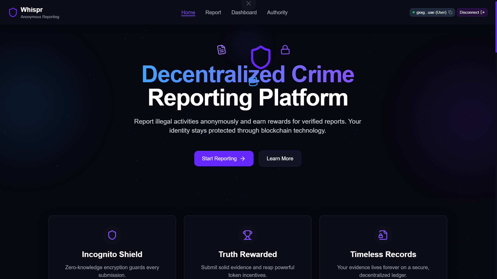
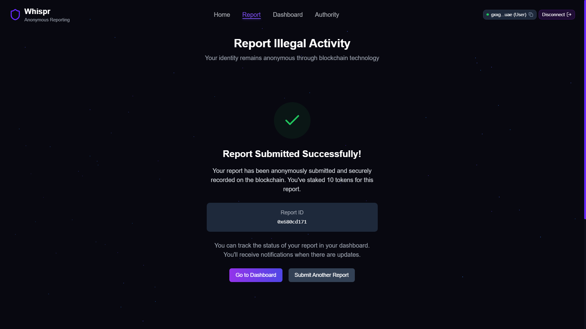
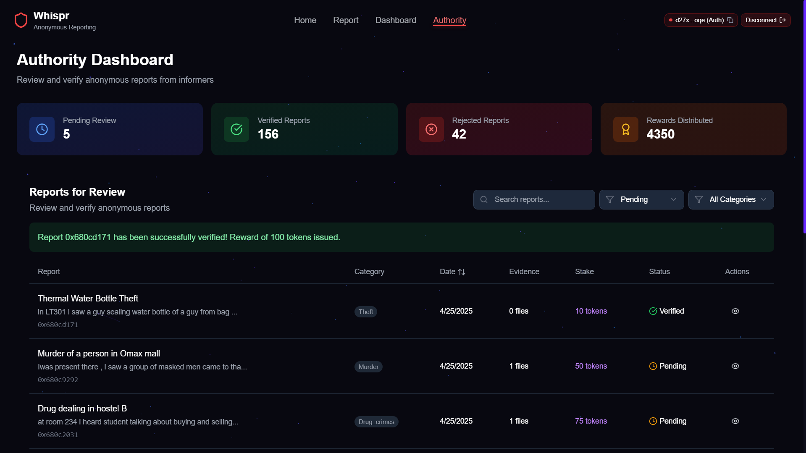
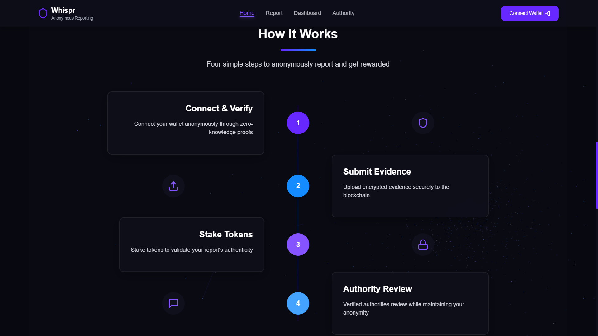
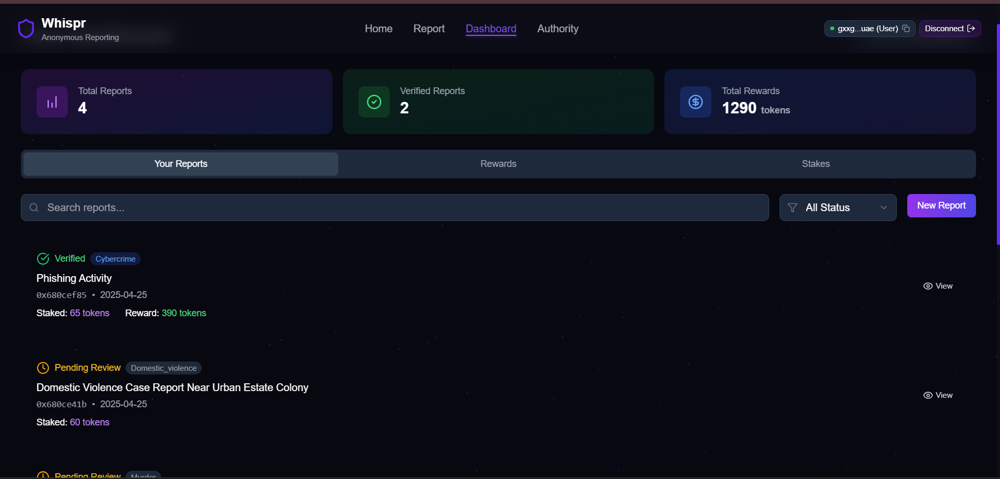

#  Whispr - Decentralized Crime Reporting Platform

 <!-- Add banner image -->

A blockchain-powered platform for anonymous crime reporting, leveraging Web3 technologies to protect informers while combating illegal activities.

## 🚀 Project Overview
**Whispr** revolutionizes crime reporting by combining zero-knowledge proofs with Internet Computer Blockchain (ICP) to ensure informer anonymity. Citizens can securely report crimes, stake tokens to validate authenticity, and earn rewards for verified reports. Authorities gain a powerful dashboard to review submissions and maintain public safety.

🔗 Live Demo: [whispr.icp.app](https://aoicy-vyaaa-aaaag-aua4a-cai.icp0.io/) 

## 🔑 Key Features
### 🛡️ For Informers
- **Anonymous Reporting**  
  - Blockchain-encrypted submissions with ZK proofs
  - Multi-category reporting (Theft, Violence, Drug Crimes, etc.)
  - Encrypted media uploads (images/videos)
  
  

  - Token staking system to deter false reports

   
  
   

### 💰 Incentive System
- **Significant Rewards** for verified reports(upto 10 times the staked tokens)
- Dynamic staking: Higher stakes = Higher credibility
- Real-time reward tracking in user dashboard

### 🕵️ Authority Tools


- Evidence decryption protocols
- Anonymous chat with informers
- Bulk report verification
- Automated token reward distribution

### 🔒 Security
- ICP blockchain storage
- Role-based access control
- End-to-end encrypted communications
- Tamper-proof evidence logs

## ⚙️ How It Works


1. **Connect & Verify**  
   Anonymous wallet connection via plug wallet
2. **Submit Evidence**  
   Encrypt and upload evidence to blockchain
3. **Stake Tokens**  
   Lock tokens to validate report authenticity
4. **Authority Review**  
   Authorities verify while preserving anonymity

## 🛠️ Tech Stack
**Frontend**  

- Javascript
- Tailwind CSS
- Web3.js

**Backend**  

- Internet Computer Blockchain
- Candid Interface

**Security**  
- Zero-Knowledge Proofs
- AES-256 Encryption
- ICP Identity Protocol

<!-- ## 📂 Folder Structure
Whispr/
├── frontend/ # React application
│ ├── public/
│ └── src/
│ ├── components/ # UI components
│ └── pages/ # Main application views
├── backend/ # Rust canisters
│ ├── reports/ # Reporting logic
│ └── tokens/ # Token management
├── assets/ # Design files & images
└── declarations/ # Auto-generated Candid interfaces -->


## 🚨 Getting Started
### Prerequisites
- Node.js ≥18.x
- DFX SDK ≥0.15.x
- Rust ≥1.70

### Installation
```bash
git clone https://github.com/your-org/whispr.git
cd Whispr

# Start local replica
dfx start --background

# Deploy canisters
dfx deploy

# Start frontend
npm run dev
Access the application at:
http://localhost:4943
```
### IPFS Storage Setup
- Every report snapshot and evidence blob is pinned to IPFS (Pinata) through secure HTTPS outcalls.
- For local testing the canister falls back to the credentials shared above, but **set your own secrets** via environment variables before `dfx deploy`:
   - `WHISPR_PINATA_KEY`
   - `WHISPR_PINATA_SECRET`
   - `WHISPR_PINATA_JWT`
- Authorities can rotate credentials on demand by calling the `configure_ipfs_credentials` update method without redeploying.
- Each report/evidence now exposes an `ipfs_cid` so the frontend (or external tooling) can fetch content directly from IPFS gateways when needed.

📸 Screenshots
	

	

	
	
